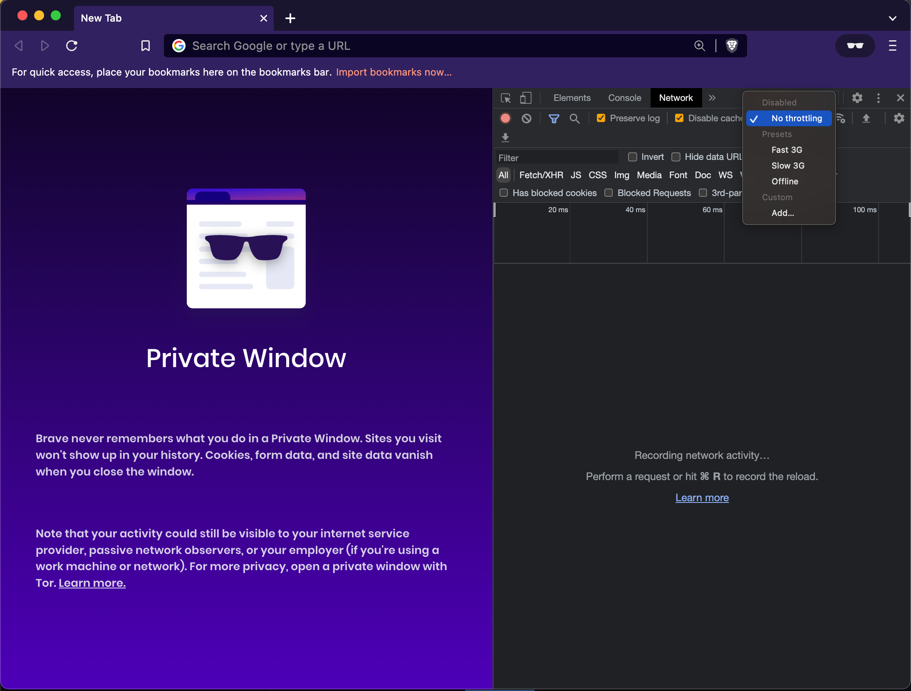

# Throttle network connection in Chrome

In the Chrome Dev Tools tab there is an option to throttle network speed to test loading
in slow connections.

[Source](https://css-tricks.com/throttling-the-network/)
