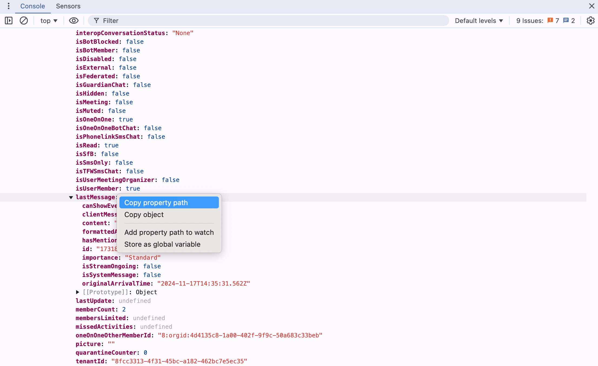

# Copy Property Path Option in Chrome DevTools

When inspecting an object in the DevTools, the `right-click > Copy property path` option can be useful for copying the path of deeply nested properties.

