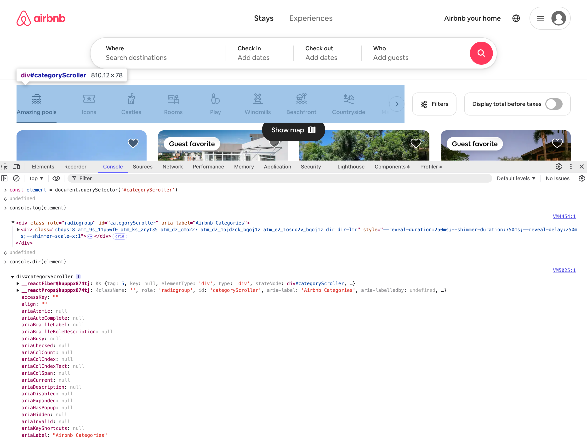

# JavaScript `console.dir` Function

The `console.dir` function logs an object to the console as a list of properties. The object is displayed hierarchically with toggles to expand and show more information, including child objects.

It can be useful to inspect a DOM node as an object, since using `console.log` prints the HTML representation. See screenshot, below:

