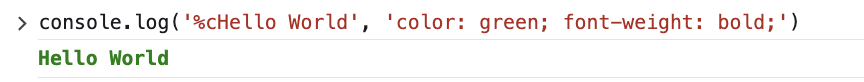

# Use `%c` to apply styling to `console.log` output

The `%c` placeholder is used to apply css style to `console.log` output. The styles are only applied to the text following the placeholder.

## Examples:

### A single style

`console.log('%cHello World', 'color: green; font-weight: bold;')`

### Two styles

The `%c` placeholder can be used more than once. See:

`console.log('%cGreen %cBlue', 'color: green;', 'color: blue;')`

