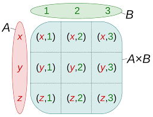

# `itertools.product` to calculate the cartesian products of input iterables



```python
>>> import itertools
>>> list(itertools.product(['x', 'y', 'z'], [1, 2, 3]))
[('x', 1), ('x', 2), ('x', 3), ('y', 1), ('y', 2), ('y', 3), ('z', 1), ('z', 2), ('z', 3)]
```

To compute the product of an iterable with itself, specify the number
of repetitions with the optional repeat keyword argument..

```python
>>> import itertools
>>> list(itertools.product(['x', 'y', 'z'], repeat=2))
[('x', 'x'), ('x', 'y'), ('x', 'z'), ('y', 'x'), ('y', 'y'), ('y', 'z'), ('z', 'x'), ('z', 'y'), ('z', 'z')]
```

[Source](https://docs.python.org/3/library/itertools.html#itertools.product)